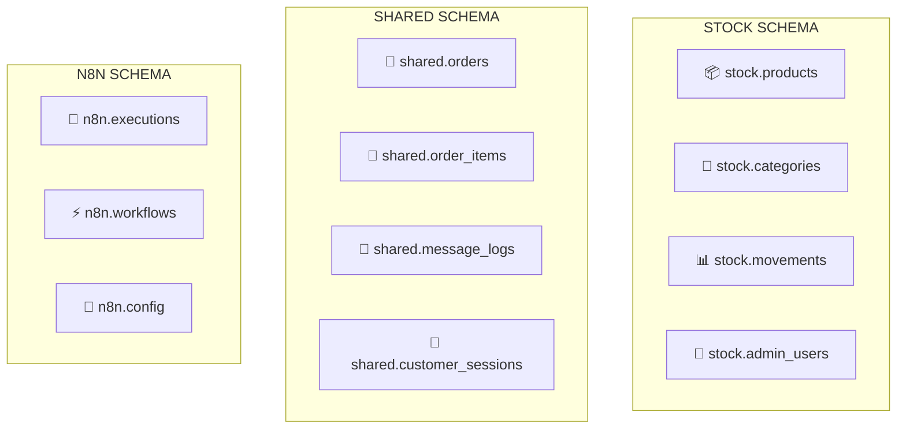

# 📊 Análisis y Organización de Esquemas SQL

## 🎯 Resumen Ejecutivo

He analizado exhaustivamente los 4 archivos SQL principales del proyecto y encontré una **estructura mixta** que necesita reorganización para soportar eficientemente:

1. **Sistema de Stock Management** (Backend + Frontend)
2. **N8N MVP** (Flujo simplificado - 1 JSON)
3. **N8N Sistema Completo** (Flujo optimizado - 6 JSONs)

## 📋 Estado Actual de los Archivos

### 1. `01_create_schemas.sql` ✅ **BIEN ESTRUCTURADO**
- **Esquemas**: `stock`, `n8n`, `shared`
- **Tablas completas**: 47 tablas bien organizadas
- **Vistas optimizadas**: 3 vistas materializadas
- **Funciones**: 3 funciones optimizadas
- **Triggers**: 6 triggers automáticos

### 2. `additional_sql_tables.sql` ⚠️ **REDUNDANTE**
- **Duplica** muchas tablas de `01_create_schemas.sql`
- **Sin esquemas**: Todas las tablas en `public`
- **Problema**: Conflictos potenciales de nombres

### 3. `init-db.sql` ⚠️ **MEZCLA INCONSISTENTE**
- **Funciones útiles** pero mal ubicadas
- **Datos mock** mezclados con DDL
- **Vista materializada duplicada**

### 4. `init-tables.sql` ❌ **PROBLEMÁTICO**
- **Esquema público**: Sin organización
- **Duplicaciones masivas** con otros archivos
- **Inconsistencias** en definiciones

## 🏗️ Problemas Identificados

### ❌ **Duplicaciones Críticas**
```sql
-- Tabla 'products' definida en 4 archivos diferentes
-- Tabla 'categories' definida en 3 archivos
-- Funciones duplicadas con nombres diferentes
```

### ❌ **Inconsistencias de Esquemas**
```sql
-- 01_create_schemas.sql: stock.products
-- init-tables.sql: public.products (sin esquema)
-- additional_sql_tables.sql: public.admin_users
```

### ❌ **Dependencias Rotas**
- Referencias a tablas inexistentes
- Foreign keys apuntando a esquemas incorrectos
- Funciones que llaman tablas en esquemas diferentes

## 🎯 Arquitectura Propuesta

### **Esquema por Componente**



## 🚀 Plan de Reorganización