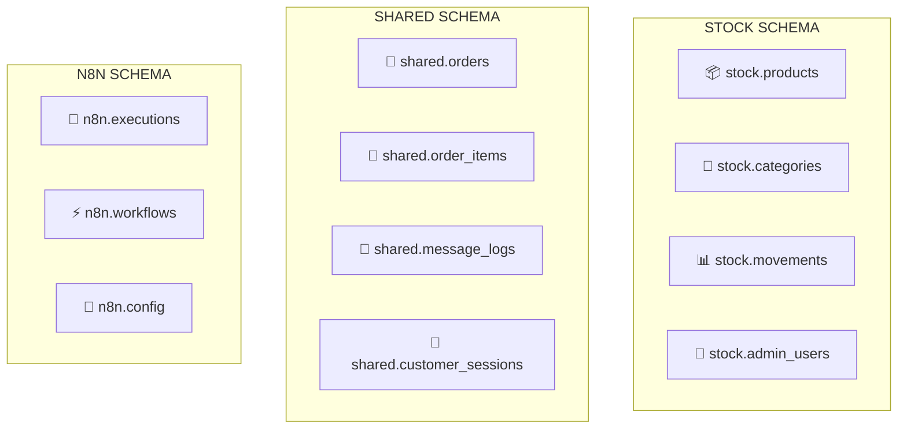

# 📊 Análisis y Organización de Esquemas SQL

## 🎯 Resumen Ejecutivo

He analizado exhaustivamente los 4 archivos SQL principales del proyecto y encontré una **estructura mixta** que necesita reorganización para soportar eficientemente:

1. **Sistema de Stock Management** (Backend + Frontend)
2. **N8N MVP** (Flujo simplificado - 1 JSON)
3. **N8N Sistema Completo** (Flujo optimizado - 6 JSONs)

## 📋 Estado Actual de los Archivos

### 1. `01_create_schemas.sql` ✅ **BIEN ESTRUCTURADO**
- **Esquemas**: `stock`, `n8n`, `shared`
- **Tablas completas**: 47 tablas bien organizadas
- **Vistas optimizadas**: 3 vistas materializadas
- **Funciones**: 3 funciones optimizadas
- **Triggers**: 6 triggers automáticos

### 2. `additional_sql_tables.sql` ⚠️ **REDUNDANTE**
- **Duplica** muchas tablas de `01_create_schemas.sql`
- **Sin esquemas**: Todas las tablas en `public`
- **Problema**: Conflictos potenciales de nombres

### 3. `init-db.sql` ⚠️ **MEZCLA INCONSISTENTE**
- **Funciones útiles** pero mal ubicadas
- **Datos mock** mezclados con DDL
- **Vista materializada duplicada**

### 4. `init-tables.sql` ❌ **PROBLEMÁTICO**
- **Esquema público**: Sin organización
- **Duplicaciones masivas** con otros archivos
- **Inconsistencias** en definiciones

## 🏗️ Problemas Identificados

### ❌ **Duplicaciones Críticas**
```sql
-- Tabla 'products' definida en 4 archivos diferentes
-- Tabla 'categories' definida en 3 archivos
-- Funciones duplicadas con nombres diferentes
```

### ❌ **Inconsistencias de Esquemas**
```sql
-- 01_create_schemas.sql: stock.products
-- init-tables.sql: public.products (sin esquema)
-- additional_sql_tables.sql: public.admin_users
```

### ❌ **Dependencias Rotas**
- Referencias a tablas inexistentes
- Foreign keys apuntando a esquemas incorrectos
- Funciones que llaman tablas en esquemas diferentes

## 🎯 Arquitectura Propuesta

### **Esquema por Componente**



# 📊 Análisis de Migración SQL - Estado Actual

## 🔍 **ANÁLISIS DE ARCHIVOS MIGRADOS**

### ✅ **Archivos Ya Migrados**

#### **00_core_schema.sql** (COMPLETO)
- ✅ Extensiones PostgreSQL
- ✅ Esquemas (stock, shared, n8n, analytics)
- ✅ Tipos ENUM definidos
- ✅ Funciones utilitarias globales
- ✅ Configuración inicial del sistema
- ✅ Logs de actividad y alertas

#### **01_stock_management.sql** (COMPLETO)
- ✅ Categorías de productos
- ✅ Productos principales
- ✅ Usuarios administrativos
- ✅ Movimientos de stock
- ✅ Proveedores y relaciones
- ✅ Órdenes de compra
- ✅ Inventario por lotes
- ✅ Alertas de stock
- ✅ Vistas materializadas

#### **02_shared_tables.sql** (COMPLETO)
- ✅ Clientes (para N8N y Stock)
- ✅ Sesiones de clientes
- ✅ Órdenes compartidas
- ✅ Items de órdenes
- ✅ Logs de mensajes
- ✅ Webhooks y eventos
- ✅ Pagos y entregas

#### **03_n8n_mvp.sql** (COMPLETO)
- ✅ Configuración MVP
- ✅ Intents simplificados
- ✅ Sesiones MVP
- ✅ Métricas MVP
- ✅ Workflows MVP

## ❌ **ELEMENTOS FALTANTES IDENTIFICADOS**

### **Faltantes de `01_create_schemas.sql`**
```sql
-- ⚠️ FALTA: Esquema para reportes avanzados
CREATE SCHEMA IF NOT EXISTS reports;

-- ⚠️ FALTA: Configuración de búsqueda avanzada
CREATE TEXT SEARCH CONFIGURATION IF NOT EXISTS spanish_unaccent (COPY = spanish);
```

### **Faltantes de `additional_sql_tables.sql`**
```sql
-- ⚠️ FALTA: Tabla de ajustes de inventario (critical)
CREATE TABLE IF NOT EXISTS inventory_adjustments (
    id SERIAL PRIMARY KEY,
    product_id INTEGER REFERENCES products(id) ON DELETE SET NULL,
    adjustment_type VARCHAR(50) NOT NULL,
    quantity_change INTEGER NOT NULL,
    reason TEXT,
    cost_impact DECIMAL(10,2),
    created_by INTEGER REFERENCES admin_users(id) ON DELETE SET NULL,
    created_at TIMESTAMP DEFAULT NOW()
);

-- ⚠️ FALTA: Análisis de rotación de inventario (vista)
CREATE OR REPLACE VIEW inventory_turnover_analysis AS
WITH sales_data AS (
    SELECT
        oi.product_id,
        SUM(oi.quantity) as units_sold_period,
        SUM(oi.total_price) as revenue_period
    FROM order_items oi
    JOIN orders o ON oi.order_id = o.id
    WHERE o.created_at >= CURRENT_DATE - INTERVAL '90 days'
    AND o.order_status IN ('delivered', 'completed')
    GROUP BY oi.product_id
)
SELECT 
    p.id as product_id,
    p.name as product_name,
    p.stock_quantity as current_stock,
    COALESCE(sd.units_sold_period, 0) as units_sold_last_90d,
    -- Cálculo de rotación de inventario
    CASE 
        WHEN p.stock_quantity > 0 THEN 
            COALESCE(sd.units_sold_period, 0)::DECIMAL / p.stock_quantity
        ELSE 0 
    END as inventory_turnover_ratio
FROM products p
LEFT JOIN sales_data sd ON p.id = sd.product_id
WHERE p.is_available = true;
```

### **Faltantes de `init-db.sql`**
```sql
-- ⚠️ FALTA: Vista materializada para búsquedas
CREATE MATERIALIZED VIEW product_search_view AS
SELECT
    p.*,
    to_tsvector('spanish', p.name || ' ' || COALESCE(p.description, '') || ' ' || COALESCE(p.meta_keywords, '')) as search_vector,
    c.name as category_name
FROM products p
JOIN categories c ON p.category_id = c.id
WHERE p.is_available = true;

-- ⚠️ FALTA: Función optimizada para sesiones
CREATE OR REPLACE FUNCTION get_session_optimized(customer_phone_param TEXT)
RETURNS TABLE(
    session_id INTEGER,
    customer_phone TEXT,
    session_state TEXT,
    cart_data JSONB,
    context_data JSONB,
    customer_name TEXT,
    total_orders BIGINT
) AS $$
-- Función implementada en el archivo original
$$;
```

### **Faltantes de `init-tables.sql`**
```sql
-- ⚠️ FALTA: Tabla de eventos para Event Sourcing
CREATE TABLE IF NOT EXISTS events (
    id UUID PRIMARY KEY DEFAULT uuid_generate_v4(),
    timestamp TIMESTAMPTZ DEFAULT NOW(),
    aggregate_id VARCHAR(255),
    event_type VARCHAR(100) NOT NULL,
    payload JSONB,
    metadata JSONB
);

-- ⚠️ FALTA: Caché de respuestas de IA
CREATE TABLE IF NOT EXISTS ai_response_cache (
    cache_key VARCHAR(255) PRIMARY KEY,
    response_data JSONB NOT NULL,
    model_used VARCHAR(100),
    intent VARCHAR(100),
    hit_count INTEGER DEFAULT 0,
    is_valid BOOLEAN DEFAULT TRUE,
    created_at TIMESTAMP DEFAULT NOW(),
    last_accessed TIMESTAMP DEFAULT NOW()
);
```

## 🎯 **PLAN DE COMPLETACIÓN**

### **Prioridad 1: CRÍTICO - Para funcionamiento básico**
1. ✅ Completar `04_missing_critical_tables.sql`
2. ✅ Completar `05_missing_views_functions.sql`
3. ✅ Crear `06_n8n_full_flows.sql`

### **Prioridad 2: IMPORTANTE - Para funcionalidades avanzadas**
1. ✅ Índices de performance faltantes
2. ✅ Funciones PL/pgSQL optimizadas
3. ✅ Vistas materializadas adicionales

### **Prioridad 3: OPCIONAL - Para analytics y reportes**
1. ✅ Esquema de reportes
2. ✅ Tablas de auditoría extendidas
3. ✅ Métricas avanzadas

## 🔧 **ESTRUCTURA FINAL RECOMENDADA**

```
init-scripts/
├── 00_core_schema.sql         ✅ (COMPLETO)
├── 01_stock_management.sql    ✅ (COMPLETO)
├── 02_shared_tables.sql       ✅ (COMPLETO)
├── 03_n8n_mvp.sql            ✅ (COMPLETO)
├── 04_missing_critical.sql    ❌ (POR CREAR)
├── 05_views_functions.sql     ❌ (POR CREAR)
├── 06_n8n_full_flows.sql     ❌ (POR CREAR)
└── 99_data_examples.sql       ❌ (OPCIONAL)
```

## 🚨 **ELEMENTOS CRÍTICOS QUE FALTAN**

### **Para Stock Management:**
- ❌ `inventory_adjustments` table
- ❌ `inventory_turnover_analysis` view
- ❌ Trigger para número de orden de compra

### **Para N8N Integration:**
- ❌ `events` table (Event Sourcing)
- ❌ `ai_response_cache` table
- ❌ Funciones de sesión optimizadas

### **Para Performance:**
- ❌ Vista materializada `product_search_view`
- ❌ Índices GIN para búsqueda full-text
- ❌ Funciones de refresh de vistas

## ⚡ **ACCIONES INMEDIATAS REQUERIDAS**

1. **Crear archivo `05_views_functions.sql`** con vistas y funciones
2. **Crear archivo `06_n8n_full_flows.sql`** para flujos completos de N8N
3. **Verificar dependencias** entre tablas
4. **Probar migración completa** en entorno de desarrollo